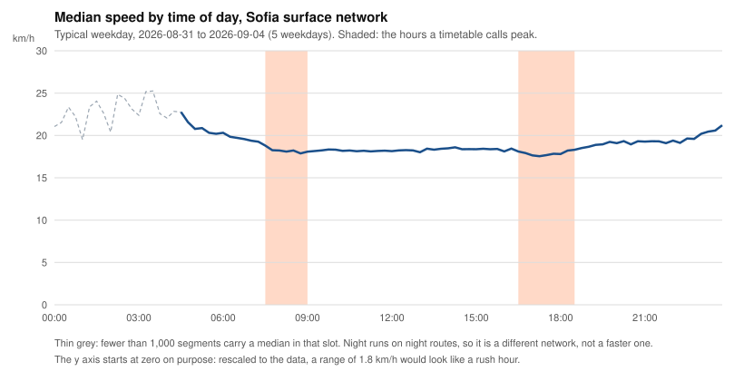

# Sofia's evening peak costs 0.4 km/h. The morning peak costs nothing

*Published 2026-09-09. Data: typical weekday, 2026-08-31 to 2026-09-04.
Bulgaria's school year had not started.*

**The question.** On a typical Sofia weekday, how much slower does the
surface network run at rush hour than at midday?

**The answer.** By 0.39 km/h in the evening, and by nothing I can measure
in the morning. The same streets are almost as slow at noon.

## What this report cannot tell you

The method is published in full and predates this result:
[METHODOLOGY.md](../METHODOLOGY.md). These limits come out of it, and I
would rather you read them before the finding than after.

- **Five weekdays, one timetable.** The medians rest on 2026-08-31 to
  2026-09-04, the longest stretch in the archive that runs on a single
  schedule. Sofia changed its timetable on 2026-09-08, which starts a new
  period and a new count. This is a measurement of one week in early
  September, not of a year and not of a season.
- **Not one school day in the archive.** Bulgaria's school year opens on
  15 September 2026, a date the Pre-school and School Education Act fixes and
  the education ministry confirmed on 25 August, turning down a proposal to
  start on the 14th. Every weekday this archive holds, 2026-08-27 through
  2026-09-08, falls in the summer holiday. The agency's own calendar reads the
  same way: the static snapshot of 2026-09-08 schedules 14,991 trips on each
  weekday of the week measured here and 15,573 on every weekday from Monday
  14 September, 582 more, the day before the schools open. Term-time mornings
  carry journeys these five days do not. If Sofia has a morning peak, this is
  the week it would be at its smallest.
- **The effect is smaller than the error of one measurement.** I derive
  speed from how far a vehicle moved between two position reports. The feed
  is polled every 45 seconds, so that is the usual gap, and it stretches
  whenever the feed skips a vehicle: the pipeline accepts gaps up to ten
  minutes and throws away anything longer. Checked against the speed field
  the feed itself sends, the median disagreement is 9.3 km/h. A difference of 0.4 km/h survives that only
  because thousands of segments and five days sit underneath it. Read it as
  a statement about the network, never about your trip this morning.
- **No metro.** Sofia's metro does not appear in the real-time feed at all.
  Everything here is trams, trolleybuses and buses.
- **One of the five days had its timetable renumbered underneath it.** On
  2026-09-02 the agency renamed 157 trips around 11:00, three hours after
  that day's static snapshot. 10,166 position records, 1.4% of the day, match
  no trip in the snapshot the day was collected under, and the pipeline
  matches them against the next snapshot instead. They are not lost, but the
  schedule they hang on is the nearest evidence rather than the build the day
  ran on.
- **Most of the network is thin.** A segment needs two observations in a
  given 15-minute slot to produce a median, and the typical segment fills
  14 of the day's 96 slots. The paired comparisons below run on roughly
  7,000 of the period's 27,138 segments: the ones observed in both slots
  being compared.
- **The night comparison is the weakest number here.** It rests on the
  1,230 segments carrying both a night and a day median, out of 20,111
  observed during the day.
- **Three of the five days are in the published dataset, two are not yet.**
  Version 1 of the dataset covers through 2026-09-02. September 3 and 4 go
  out with the next version. Until then you can reproduce three fifths of
  this from the archive and the rest from the code.

## The profile



Between 07:00 and 19:00 the network's median speed moves between 17.55 and
19.38 km/h. The whole daytime range is 1.83 km/h. The slowest quarter hour
of the day falls at 17:15, and it sits 0.6 km/h under noon.

The shaded bands mark the hours a timetable calls peak. Nothing happens
inside them.

## The same segments, at two times of day

A network median at 08:00 and a network median at 12:00 describe different
populations of street, so the difference between them mixes the time of day
with which streets happened to be running. Every comparison below pairs a
segment against itself.

A segment reading exactly 0 km/h on either side drops out, between 7 and 67
of them per row. Five weekdays of no movement in one quarter hour describes
a vehicle standing at a terminus, not the speed of a street. The night row
compares 00:00 to 03:45 against 07:00 to 18:45.

| Comparison | Segments with both | Median difference | Slower at the first time |
|---|---|---|---|
| 08:00 against 12:00 | 7,088 | +0.04 km/h faster | 49.5% |
| 17:15 against 12:00 | 6,846 | 0.39 km/h slower | 54.3% |
| 17:15 against 08:00 | 7,166 | 0.34 km/h slower | 53.8% |
| Night against day | 1,230 | 1.26 km/h faster at night | 39.1% |

The morning peak is a coin flip. Half the segments are slower at 08:00 than
at noon, half are faster, and the median segment gains 0.04 km/h. The
evening is real but small: 54.3% of segments are slower at 17:15 than at
midday, by 0.39 km/h at the median.

Segment to segment, the spread dwarfs both. The middle half of the morning
comparison runs from 2.70 km/h slower to 2.75 km/h faster. Time of day
tells you almost nothing about how fast a given piece of Sofia moves. The
piece itself tells you almost everything.

## Slow at eight, slow at noon

If rush hour made the network slow, the slow segments would recover during
the day. They do not.

| Segments under this speed at 08:00 | How many | Still under it at 12:00 |
|---|---|---|
| 10 km/h | 1,086 | 61.5% |
| 15 km/h | 2,807 | 76.5% |
| 20 km/h | 4,515 | 86.5% |

Both tables run on the same 7,088 segments, the ones carrying a median at
08:00 and at 12:00 alike. Take the 2,807 running below 15 km/h during the
morning peak. Four hours later, 2,146 of them are still below 15 km/h. Whatever holds
them there keeps holding at noon.

One count here will not match the method document, and it should not.
[METHODOLOGY.md](../METHODOLOGY.md) reports 1,209 segments under 10 km/h at
08:00 in this same period. That figure covers all 9,903 segments carrying an
08:00 median and reads the whole km/h the map publishes, where "under 10"
means under 9.5. The 1,086 above covers only the 7,088 segments that also
carry a midday median, at full precision. Take the full 9,903 at full
precision and the count is 1,373. Same period, three questions.

The night line in the figure looks like the free-flow those streets could
reach, and it is not. Night service runs on night routes: 2,589 segments
see a night vehicle against 20,111 during the day, and they are not the
same streets. Compared against themselves, the 1,230 segments that appear
in both windows gain 1.26 km/h after midnight, once the traffic, the
passengers and the stops are gone.

## What I am claiming, and what I am not

Sofia's surface network is not slowed down by rush hour so much as held at
one speed all day. The claim covers the median across the network. It says
nothing about a particular street: individual segments do slow at peak, and
the interactive map marks them where the data supports it.

The claim also covers a week without school. Sofia's schools open on
15 September and the timetable grows by 582 weekday trips the day before, so
the week of 14 September is a direct test of this report. I will run the same
script on it and publish what it gives.

I am not claiming to know why. Signal timing, stop dwell, lane sharing and
turning conflicts all fit this shape, and none of them are in a GTFS feed.
A flat profile rules out one explanation, that congestion at two hours of
the day sets the pace of the network. Testing the rest needs data I do not
have.

## Check it yourself

Every number in this report comes from one script,
[`scripts/plot_daily_profile.py`](../scripts/plot_daily_profile.py), which
also draws the figure. It prints the full 96-slot profile with the segment
count behind each point:

```sh
python3 scripts/plot_daily_profile.py \
    data/sofia/processed/typical_weekday.json \
    reports/figures/2026-09-09-daily-profile.svg
```

- **Method:** [METHODOLOGY.md](../METHODOLOGY.md), archived at
  [10.5281/zenodo.22256653](https://doi.org/10.5281/zenodo.22256653)
- **Raw data:** [10.5281/zenodo.22285128](https://doi.org/10.5281/zenodo.22285128),
  CC BY 4.0
- **Map:** https://stassuslov.github.io/sofia-pt-web/

Feed data comes from Sofia's open data portal
([urbandata.sofia.bg](https://urbandata.sofia.bg), CC BY 4.0), published by
Sofia Urban Mobility Centre. Errors in this report are mine. If you find
one, the raw data is right there and I would like to know.
