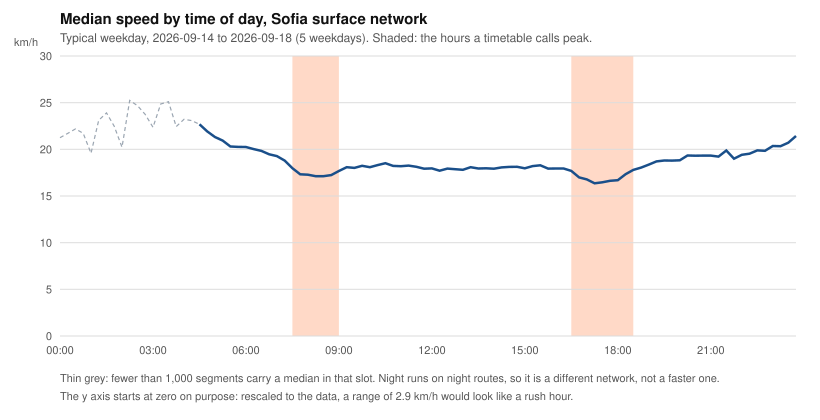

# Sofia's morning peak shows up in the first school week. The evening peak grows to 1 km/h

*Published 2026-09-21. Data: typical weekday, 2026-09-14 to 2026-09-18, the
first week of Bulgaria's school year. This repeats
[the report of 2026-09-09](2026-09-09-peak-vs-permanent.en.md) on the week
that report named as its own test, with the same script and the same
method.*

**The question.** On a typical Sofia weekday, how much slower does the
surface network run at rush hour than at midday? The first report answered
it on a week of school holidays and promised the answer again on a term
week.

**The answer.** This week the morning peak runs 0.24 km/h under midday and
the evening peak 0.96 km/h under it, against 0.04 km/h over and 0.39 km/h
under in the holiday week of 31 August. Compared segment by segment against
the week before the schools opened, the same streets lost 0.44 km/h at 08:00
and 0.48 km/h at 17:15, while midday lost 0.11 and the night nothing.
Neither half of the first report's headline survives its own test unchanged.
Sofia has a morning peak, and the evening peak has grown.

## What this report cannot tell you

The method is published in full and predates this result:
[METHODOLOGY.md](../METHODOLOGY.md). These limits come out of it, and I
would rather you read them before the finding than after.

- **Two changes arrived in the same week.** The schools opened on 15
  September, and the agency ran a larger timetable in the same days: 16,628
  trips over 137 routes on Monday, rising to 16,710 over 139 by Friday,
  against 14,991 over 136 on every weekday of the week of 8 September. Each
  count comes from that day's own snapshot. Nothing in this data separates
  children travelling from roughly 1,700 more trips a weekday sharing the
  street. Read the result as what the week did, not as what school did.
- **The timetable I forecast was not the timetable that ran.** The first
  report quoted the snapshot of 8 September, which scheduled 15,573 trips
  for every weekday from 14 September. The week ran between 16,628 and
  16,710. A snapshot describes the timetable as of the day it was taken, and
  that one was taken six days early. It undershot by about 1,100 trips a day.
- **Five weekdays, four timetables.** The August week ran one schedule from
  Monday to Friday. This week the agency published a different one on four
  of the five days, and the pipeline groups them into a single median
  because each stays within 0.5% of Monday's: churn of 34, 34, 70 and 82
  trips against a tolerance of 83.1. Friday joined this week with 1.1 trips
  to spare. Had it missed, the week would have split into two medians and
  this report would rest on four days. The rule is published and predates
  the week. The margin is luck.
- **Monday was not a school day.** The feed put the term timetable in place
  on Monday 14 September, and the schools opened on Tuesday the 15th. One of
  the five days under this median runs term service without term traffic.
  That pulls the morning figure towards zero, not away from it.
- **Weather, roadworks and everything else on the street are missing from
  this pipeline.** I am comparing a week in mid-September against a week in
  early September, and I cannot rule out whatever else changed between them.
  The one control I have is another pair of weeks: between the holiday week
  of 31 August and the holiday week of 8 September, the same segments moved
  0.05 km/h at 08:00. That bounds the week-to-week drift I can see on one
  pair of weeks, not on every pair.
- **The effect is smaller than the error of one measurement.** I derive
  speed from how far a vehicle moved between two position reports, 45
  seconds apart when the feed behaves. Checked against the speed field the
  feed itself sends, the median disagreement is 9.3 km/h. A difference of
  0.4 km/h survives that only because thousands of segments and five days
  sit underneath it. Read it as a statement about the network, never about
  your trip this morning.
- **Most of the network is thin.** A segment needs two observations in a
  15-minute slot to produce a median. The paired comparisons below run on
  about 7,800 of this period's 26,807 segments, and the week-over-week rows
  on about 7,200 of the 23,522 segments both weeks carry.
- **The night row is the weakest number here.** It rests on the 1,246
  segments carrying both a night and a day median, out of 20,102 observed
  during the day.
- **None of this week is in the published dataset yet.** Version 1 covers
  through 2 September. This week goes out with version 2, which covers 3 to
  30 September. Until then you can reproduce it from the code and the map,
  not from the archive.
- **No metro.** Sofia's metro does not appear in the real-time feed at all.
  Everything here is trams, trolleybuses and buses.

## The profile



Between 07:00 and 19:00 the median speed moves between 16.36 and 19.28 km/h.
The daytime range is 2.92 km/h, against 1.83 in the holiday week of 31
August and 2.69 in the week of 8 September. The slowest quarter hour of the
day is still 17:15.

The morning now has a floor of its own. The line falls from 19.28 km/h at
07:00 to 17.12 at 08:15 and holds there through 08:30, then climbs back over
18 km/h by 09:15. Midday sits at 17.96.

The shaded bands mark the hours a timetable calls peak. In the first report
nothing happened inside them. This week both of the day's low stretches fall
inside them.

## The same segments, at two times of day

A network median at 08:00 and a network median at 12:00 describe different
populations of street, so the difference between them mixes the time of day
with which streets happened to be running. Every comparison below pairs a
segment against itself. A segment reading exactly 0 km/h on either side
drops out, between 6 and 70 of them per row.

| Comparison | Segments with both | Median difference | Slower at the first time |
|---|---|---|---|
| 08:00 against 12:00 | 7,786 | 0.24 km/h slower | 52.3% |
| 17:15 against 12:00 | 7,537 | 0.96 km/h slower | 59.2% |
| 17:15 against 08:00 | 7,905 | 0.58 km/h slower | 55.4% |
| Night against day | 1,246 | 1.36 km/h faster at night | 38.8% |

In the holiday week the morning row read 0.04 km/h faster on 49.5% of
segments, which is a coin flip. Here it points one way on both counts. The
evening row has gone from 0.39 km/h to 0.96.

The spread between segments still dwarfs both numbers. The middle half of
the morning comparison runs from 3.48 km/h slower to 2.44 km/h faster. Time
of day tells you a little more about Sofia than it did in August, and the
piece of street still tells you most of it.

## The same segments, one week apart

Segment keys address geometry by content, so a segment keeps its identity
through a timetable change and 23,522 of them appear in both weeks. Each row
below runs on the ones carrying a median at that time in both: between 6,715
and 7,608 segments per hour, 17,273 and 17,415 for the daytime window, 1,860
and 2,057 for the night.

| Time of day | 8 Sep week minus 31 Aug week | 14 Sep week minus 8 Sep week |
|---|---|---|
| 07:00 | +0.02 | -0.26 |
| 08:00 | -0.05 | -0.44 |
| 09:00 | -0.05 | -0.14 |
| 12:00 | -0.05 | -0.11 |
| 14:00 | -0.14 | -0.34 |
| 17:15 | -0.26 | -0.48 |
| 18:00 | -0.30 | -0.39 |
| 07:00 to 18:45 | -0.08 | -0.18 |
| 00:00 to 03:45 | -0.08 | -0.01 |

Values are km/h, and a negative number means the later week is slower.

The left column compares two weeks without school, 84 trips a day apart in
timetable. The morning holds still at 0.05 km/h, which is the size of the
week-to-week movement I can see. The evening does not: 17:15 had already
slipped 0.26 km/h and 18:00 by 0.30 before a single school opened. Whatever
is slowing Sofia's evenings started before term did.

The right column is the school week arriving. The morning moves 0.44 km/h against
the control column's 0.05 at the same hour, and the hours around it move
with it. Midday moves 0.11 and the night 0.01. The
change concentrates where term traffic would put it, in the hours schools
and offices fill, and leaves the night alone.

## Slow at eight, slow at noon

If rush hour made the network slow, the slow segments would recover during
the day. Most of them still do not.

| Segments under this speed at 08:00 | How many | Share of the 7,786 paired | Still under it at 12:00 |
|---|---|---|---|
| 10 km/h | 1,610 | 20.7% | 55.3% |
| 15 km/h | 3,461 | 44.5% | 74.2% |
| 20 km/h | 5,180 | 66.5% | 85.2% |

Both tables run on the same 7,786 segments, the ones carrying a median at
08:00 and at 12:00 alike. In the August week the first row held 1,086
segments, 15.3% of the paired population then, and 61.5% of them were still
under 10 km/h at noon.

Two things moved at once. More of the network is slow at 08:00 than in
August, and fewer of those keep it up until midday. Both point the same way:
some of this week's morning slowness belongs to the morning rather than to
the street. It stays the minority. Of the segments crawling under 10 km/h
during the school-week morning peak, 890 of 1,610 are still crawling four
hours later.

## What I am claiming, and what I am not

The first report found that Sofia's surface network is held at one speed all
day rather than slowed by rush hour. That claim covered a holiday week, and
this week takes the morning half of it away. A morning peak exists: 0.24 km/h below midday
across the network, 0.44 km/h below the same segments a week earlier. It is
small, and it is no longer nothing.

The rest holds. The network still spends its whole day inside a range of
under 3 km/h, and the streets that are slow at 08:00 are mostly slow at
noon. Rush hour still does not explain most of Sofia's slowness.

I am not claiming that school did this. Term and a timetable 11% larger
arrived in the same five days, and nothing in this data separates them. A
bigger timetable puts more vehicles on the same streets, which is a traffic
effect of its own.

I am not claiming to know why the evenings keep sliding. They were sliding
between two holiday weeks already, and they slid further in this one.
Signal timing, stop dwell, lane sharing and turning conflicts all fit that
shape, and none of them are in a GTFS feed.

The archive keeps collecting. When a full month of term weeks is in it, the
same script runs again and I publish what it gives, in whichever direction
it goes.

## Check it yourself

The figure and every speed number in this report come from one script,
[`scripts/plot_daily_profile.py`](../scripts/plot_daily_profile.py), which
prints the full 96-slot profile with the segment count behind each point:

```sh
python3 scripts/plot_daily_profile.py \
    data/sofia/processed/typical_weekday.json \
    reports/figures/2026-09-21-daily-profile.svg \
    --period 89f170ee702a0c81 --against 2cdbd38d38fe0cd7
```

The control column of the week-over-week table comes from the same script
run over the two holiday weeks, `--period 2cdbd38d38fe0cd7 --against
f67e7128747733b2`.

The trip counts per day live in `day_breakdown` in
`data/sofia/processed/typical_weekday.json`, which the pipeline writes from
each day's own static snapshot. The churn figures behind the 83.1-trip
tolerance come from `schedule_churn()` and `schedule_signature()` in
[`scripts/segment_speeds.py`](../scripts/segment_speeds.py), read out of the
snapshots in the dataset.

- **Method:** [METHODOLOGY.md](../METHODOLOGY.md), archived at
  [10.5281/zenodo.22256653](https://doi.org/10.5281/zenodo.22256653)
- **Raw data:** [10.5281/zenodo.22285128](https://doi.org/10.5281/zenodo.22285128),
  CC BY 4.0. Version 1 stops on 2 September; this week goes out with version 2
- **Map:** https://stassuslov.github.io/sofia-pt-web/, which opens on this
  week

Feed data comes from Sofia's open data portal
([urbandata.sofia.bg](https://urbandata.sofia.bg), CC BY 4.0), published by
Sofia Urban Mobility Centre. Errors in this report are mine. If you find
one, the raw data is right there and I would like to know.
